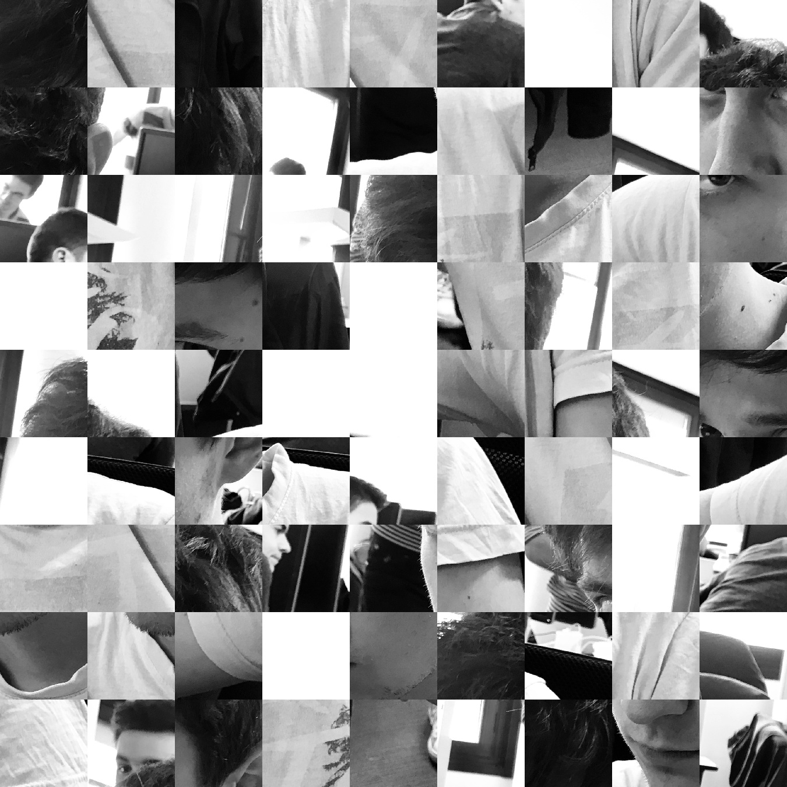

# solvepuzzle

Collaborative project to solve Jigsaw puzzle (in order to solve puzzles from the facebook page "association des centraliens").

## 1. Puzzle Class

You should use the `Puzzle` class and its methods in order to solve the puzzle

## 2. Input

The images you want to analyse have to be stored in the `data/input` folder

## 3. Output

The result of the algorithm could be save in the `data/ouput` folder

## 4. Dependencies

`Numpy`

`Image`

`matplotlib`